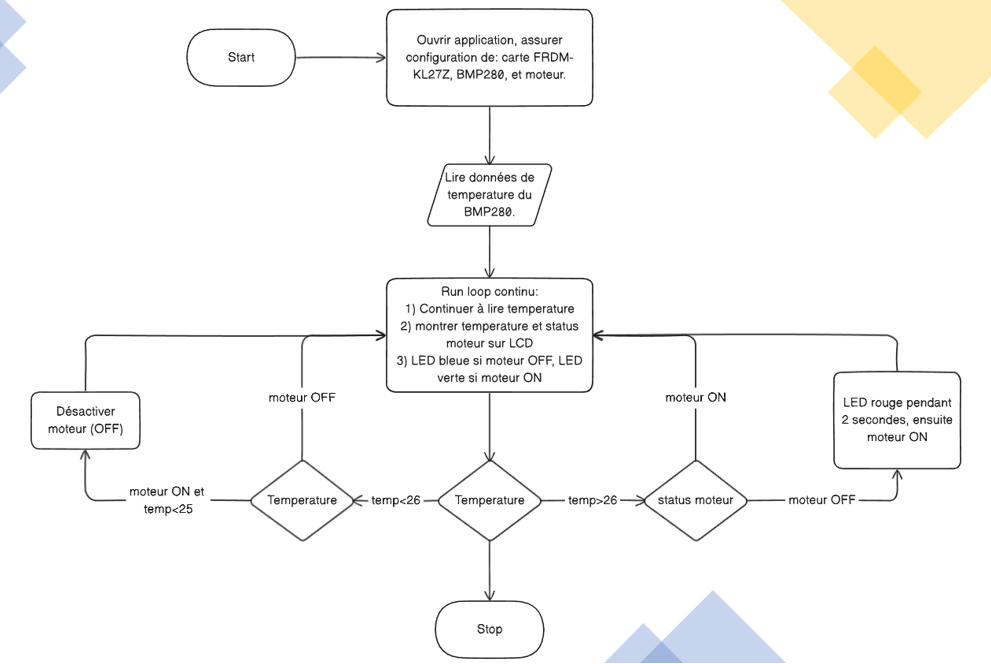
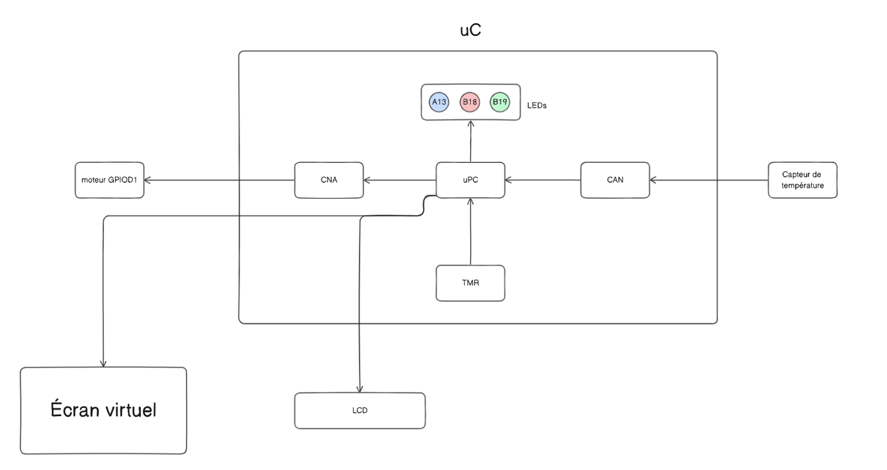
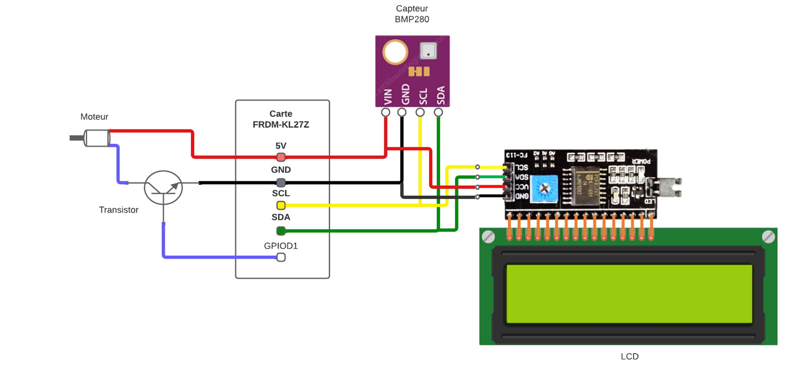
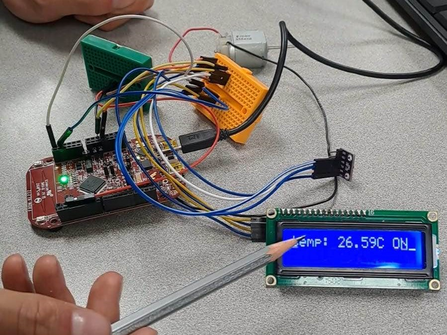

# Automatic-Fan-System
A C-based embedded system to activate a fan automatically depending on room temperature.

## Objective
Model a real-time system that emulates an automatic fan or AC system.

## Material Components
There are four main material components for this project:

* Freedom FRDM-KL27Z Card
* BMP280 Temperature Capture Card
* 16x2 LCD Display
* Motor to simulate a fan

## How it works

### LCD
The LCD shows the current temperature of the system and if the motor(fan) is on or off. The LCD will display the current temperature of the system as well as the word "OFF" or "ON" to indicate the status of the motor.

### Processus

1. Read the temperature from the BMP280 capture card.
2. Show the temperature and motor status on the LCD.
3. On the FRDM-KL27Z card, if the motor is "OFF", the internal LED of the card will be BLUE. If the motor is "ON", the internal LED of the card will be GREEN. If the motor is "OFF", but the temperature has risen to where it will turn on shortly, the LED will turn RED for two seconds, before the motor turns on and the LED will then be green as usual.

There are two temperatures to note: 25 degrees and 26 degrees; the two critical temperatures. The system's goal is to keep the temperature below 26 degrees, but not have the motor constantly turning on and off. 

If the temperature is over 26 degrees, the room is too hot, and the motor should be on. If the temperature is under 26 degrees, then we monitor the state of the motor, whether it is already on or still off. If the motor is on, we will keep it on until the room cools down to 25 degrees, as we don't want the motor to oscillate annoyingly between on and off. If the motor is off, it stays off.

Here is an organigram representing the system's proper function, in French. 

### Other Image References

Here are some other images of the system:

#### Card Configuration

#### Theoretical Electrical Configuration

#### IRL Model

